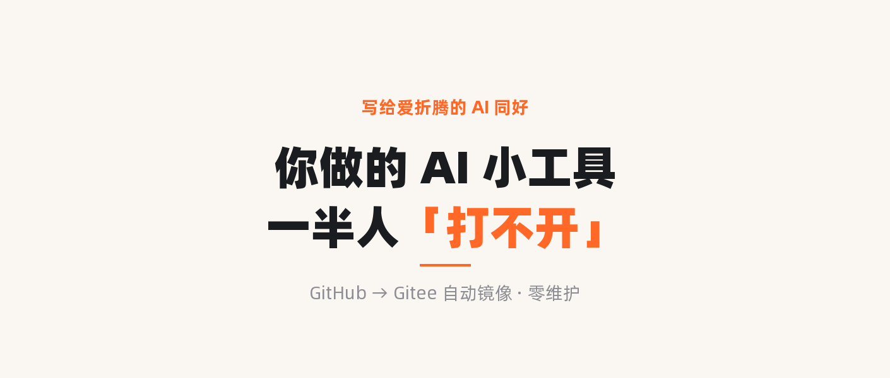

# magic-ai-skills

> **一次装好，多平台复用。** 把「说过的话、记过的料、写好的稿」自动变成能用的成品。

神奇桑桑自制的一组 Magic AI 工作流 Skill，各自独立、一句话就能装，装一次即可在 Codex / Claude 等平台复用。

---

## ✨ 核心能力

| 🎙 把口述变笔记 | 📚 把碎片变知识库 | ✍️ 把 Markdown 变公众号草稿 |
| --- | --- | --- |
| 语音、转写、Get 笔记素材 → 有结构的思考记录 | 剪藏、AI 对话、松散想法 → Obsidian / ima 知识资产 | 一篇稿子 → 排版+封面就绪的公众号草稿 |
| `magic-recorder` | `magic-kb-compiler` | `magic-wechat` |

---

## 🎬 使用场景示例

### 🎙 magic-recorder —— 把"说过的话"变成"能用的笔记"

> **你**：帮我把这段语音整理成笔记 ——「呃就是那个…我今天想到啊，支付流程是不是可以加个进度条，用户等的时候就不那么焦虑了…」
>
> **它**：已整理成《支付流程优化想法》思考记录 —— 去掉口水话、提炼成 1 个核心观点 + 2 条延伸，存为 Markdown。

**适合谁**：习惯口述、语音输入、随手记的人。一堆口水话 → 有标题、有逻辑、能复用的记录。

### 📚 magic-kb-compiler —— 把零散素材编译进知识库

> **你**：把我这周的剪藏和几段 AI 对话，编译进我的 Obsidian 知识库。
>
> **它**：拆成 5 张 cards、2 个 wiki 主题，自动建立双链、归好类，写入 Obsidian（raw / cards / wiki / views / logs 全套）。也能导出成 ima 可导入的知识包。

**适合谁**：在搭个人/团队知识库的人。一堆碎片 → 互相链接、可检索的知识体系。

### ✍️ magic-wechat —— Markdown 写完，一键出公众号草稿

> **你**：把这篇 Markdown 出成公众号草稿。
>
> **它**：套好固定排版（名片卡 + 橙色标题分割 + 固定页尾）、本地生成可商用文字封面、存进草稿箱，留言/只关注可评/原文链接都配好了 —— 去草稿箱看，只剩原创、合集几个手动开关。

| 文字封面（本地绘制 · 可商用字体 · 2.35:1 兼容朋友圈 1:1） | 排版效果（名片卡 + 橙竖条标题 + 固定页尾） |
| --- | --- |
|  |  |

**适合谁**：自己运营公众号、想把出稿流程提速的人。

---

## 📦 一句话安装

这几个 Skill 各自独立。把下面这段发给支持 GitHub / Skill 安装的 Agent（Codex、Claude 等），它会自己拉取并装到对应 `skills` 目录：

```text
请从 GitHub 仓库安装 Magic AI Skills。

仓库地址：https://github.com/cyanskye/magic-ai-skills

安装这些自制 Skills（也可只装其中一个，按需点名）：
- skills/magic-recorder
- skills/magic-kb-compiler
- skills/magic-wechat

不要安装 getnote、系统 Skills、插件缓存 Skills、第三方 Skills 或历史版本。
```

只装单个时，把列表换成你要的那一个即可，例如「只安装 skills/magic-wechat」。

---

## 🚀 怎么用（一句话触发）

| 想做的事 | 这样说 |
| --- | --- |
| 整理口述/转写 | `请使用 magic-recorder，把下面这段口述整理成 Markdown 思考记录：…` |
| 编译进 Obsidian | `请使用 magic-kb-compiler，把这份材料编译成 Obsidian 知识资产。路径是：…` |
| 导出给 ima | `请使用 magic-kb-compiler，把这份材料整理成 ima 可导入的知识包，保留来源/摘要/主题。` |
| 发公众号 | `请使用 magic-wechat，把这篇 Markdown 整理成公众号草稿（套排版、出文字封面、存草稿箱，不直接群发）。` |

---

## 🔗 来源标注

规矩：**凡是从他人 Skill 衍生或运行时依赖的，都在此标注原 Skill 的位置/来源。**

- `magic-wechat`：公众号发布思路源自**宝玉 `baoyu-post-to-wechat`**（宝玉 Skills 系列，安装于 `~/.claude/skills/baoyu-post-to-wechat`）。本仓库 `scripts/publish.py` 为自建实现，直调微信官方 `draft/add` API，**不含宝玉源码**；排版样式取自神奇桑桑本人公众号文章。

---

## 📋 当前包含

| Skill | 作用 | 主要依赖 |
| --- | --- | --- |
| `magic-recorder` | 口述/转写/Get 笔记 → 结构化 Markdown 思考记录 | Get 笔记官方能力（可选）、本地 Markdown 工作区（可选） |
| `magic-kb-compiler` | 语音笔记/剪藏/AI 对话/松散想法 → 可迁移知识资产 | Get 笔记官方能力（可选）、Obsidian / ima |
| `magic-wechat` | Markdown 文章 → 固定排版 + 本地文字封面 + 公众号草稿 | 微信公众号官方 API、Pillow + 阿里普惠体；源自宝玉 `baoyu-post-to-wechat` |

---

## ⛔ 不收录

- 第三方或他人创建的 Skills、系统内置 Skills、插件缓存 Skills、外部服务配套 Skills、历史版本
- 真实 token、cookie、`.env`、私密笔记内容

> 本仓库为公开仓库，已确认不含任何密钥/凭据（`.env` 等敏感文件均在 `.gitignore`）。

## 📚 详细文档

- [docs/install.md](docs/install.md) · [docs/runtime-compatibility.md](docs/runtime-compatibility.md) · [docs/external-dependencies.md](docs/external-dependencies.md) · [registry/skills.json](registry/skills.json)
