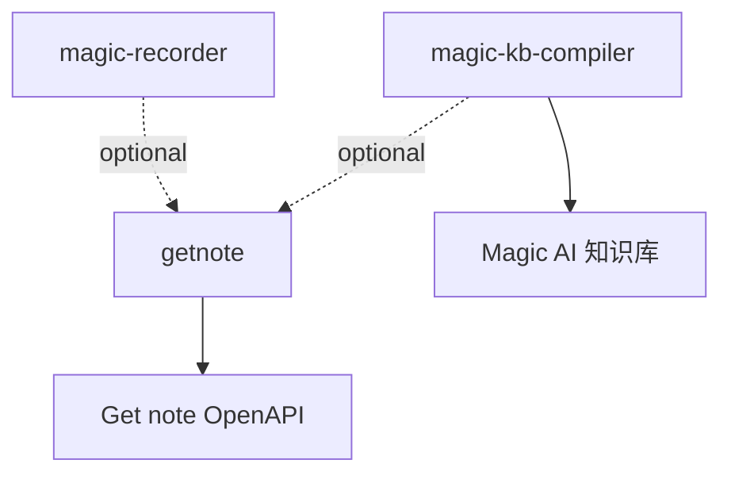

# Skills 依赖关系

## 内部依赖

| Skill | 依赖 | 关系 | 说明 |
| --- | --- | --- | --- |
| `magic-recorder` | `getnote` | optional | 当用户提供 Get 笔记链接、要求读取最新 Get 笔记、或按关键词读取 Get 笔记时使用 |
| `magic-kb-compiler` | `getnote` | optional | 当输入来源是 Get 笔记共享链接、私有 Get 笔记、或 Get 笔记导入 Magic AI 知识库时使用 |

## 外部依赖

| Skill | 外部依赖 | 类型 | 说明 |
| --- | --- | --- | --- |
| `getnote` | Get 笔记 OpenAPI | service | 需要 `GETNOTE_API_KEY`、`GETNOTE_CLIENT_ID`，可选 `GETNOTE_OWNER_ID` |
| `magic-kb-compiler` | Magic AI 知识库 / Obsidian vault | local workspace | 默认编译到本机 Magic AI 知识库路径，仓库不包含知识库内容 |

## Mermaid 图

