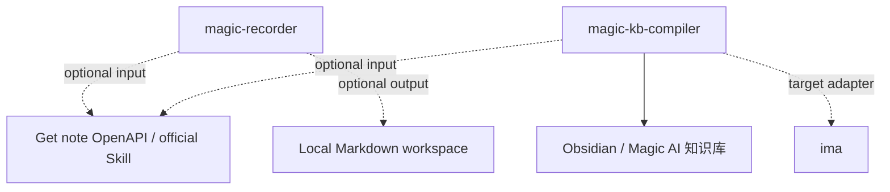

# Skills 依赖关系

## 内部依赖

当前没有内部 Skill 依赖。

`magic-recorder` 和 `magic-kb-compiler` 都是本仓库的一等 Skill；它们可以独立被触发。外部系统分成两类：输入源和目标平台。

## 外部依赖

| Skill | 外部依赖 | 类型 | 必需性 | 说明 |
| --- | --- | --- | --- | --- |
| `magic-recorder` | Get 笔记官方 OpenAPI / Skill | external service | optional | 当输入来自 Get 笔记链接、最新笔记、指定笔记或关键词查询时使用 |
| `magic-recorder` | 本地 Markdown 工作区 | local filesystem | optional | 保存整理后的个人思考记录 |
| `magic-kb-compiler` | Get 笔记官方 OpenAPI / Skill | external service | optional | 当输入来源是 Get 笔记时使用 |
| `magic-kb-compiler` | Obsidian / Magic AI 知识库 | local workspace | target mode | 当前最完整的本地落地目标，支持 raw、cards、wiki、views 和 logs |
| `magic-kb-compiler` | ima | knowledge platform | target mode | 可作为知识库目标平台，适合导入整理后的 Markdown、知识条目或文档包 |

## 运行环境兼容

| 环境 | 兼容方式 | 说明 |
| --- | --- | --- |
| Codex | native/local skills | 直接使用本地 `skills/` 目录 |
| Claude | native/local skills | 直接使用本地 `skills/` 目录 |
| ima | rule source + target platform | 可读取规则，也可作为知识库目标 |
| WorkBuddy | rule source | 读取 `SKILL.md` 后按平台能力执行 |
| OpenClaw | rule source | 读取 `SKILL.md` 后按平台能力执行 |
| Hermes | rule source | 读取 `SKILL.md` 后按平台能力执行 |

## Mermaid 图

